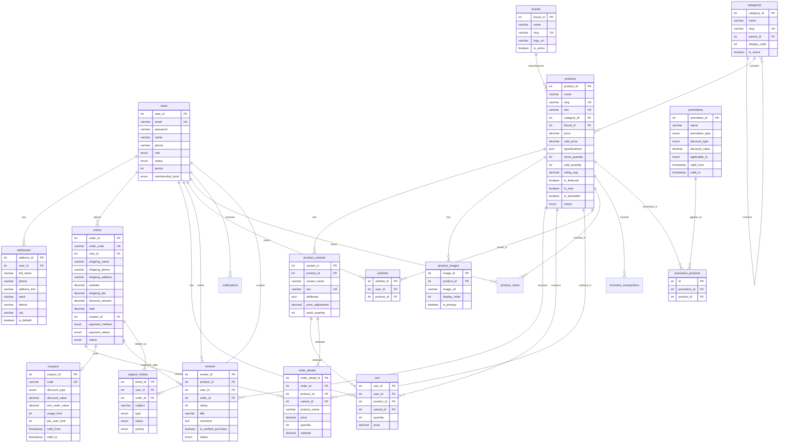

-- ==================================================
-- MOBILE SHOP - ER DIAGRAM (Mermaid Format)
-- Sơ đồ quan hệ thực thể
-- ==================================================

---

## Giải thích quan hệ:

### 1-n (One to Many):
- Một user có nhiều addresses, orders, cart items, reviews
- Một product có nhiều variants, images, reviews
- Một order có nhiều order_details
- Một category có thể chứa nhiều categories con (self-reference)

### n-n (Many to Many):
- products và promotions (thông qua promotion_products)

### Optional (có thể null):
- order có thể có hoặc không có coupon
- product có thể có hoặc không có brand
- review có thể liên kết với order (nếu verified purchase)
